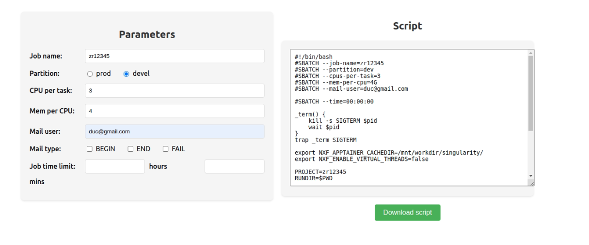

# SLURM Script Generator

## Project Description

SLURM Script Generator is a web application that helps users easily create scripts for running jobs on the SLURM workload manager. The application provides a user-friendly interface that allows users to input necessary parameters and automatically generates a script tailored to their requirements. 

## System Requirements

- Node.js (>= 14.x)
- npm (>= 5.x)

## Installation and Running Instructions

### Clone the Repository

Clone the repository to your local machine:

```bash
git clone https://github.com/PI-Bioinfo/Slurm_Script.git
cd Slurm_Script
```

### Install Dependencies
```bash
npm install
```

### Run the Application
```bash
npm start
```

The application will run on http://localhost:3000. Open your browser and enter this address to access the application.

### Usage Instructions
1. Navigate to the application at http://localhost:3000.
2. Enter the necessary parameters in the input fields provided on the user interface.
3. Click the "Download script" button to create the SLURM script.

## Demo image


